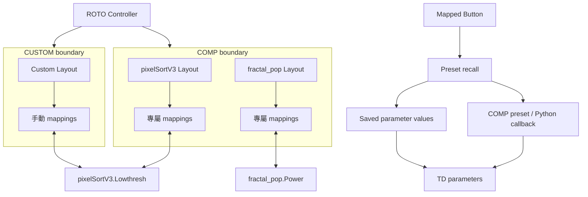

# COMP / CUSTOM Layout boundaries and Button Presets

Status: approved product direction and ticket breakdown; runtime implementation pending.

## Agreed behavior

- 用 COMP／CUSTOM 作保存邊界。每個已註冊 COMP 有專屬 Layout；手動 Custom Layout 保存獨立 mappings。
- COMP 同 CUSTOM 可以 map 同一個 TD parameter，並同步讀取該 parameter 嘅真實 value。
- Assignment、range、control pages 同 off-page library 各自保存。共享 parameter value 唔等於共享 mapping 配置。
- 支援兩種 Button Preset：Action preset 調用 COMP 已有 preset／Python callback；Snapshot preset 由工具保存及 recall 選定 parameters 嘅 values。
- Layout selection 讀取 live parameter values。Preset recall 係另一個明確操作。

虛擬分類邊界描述配置 ownership。每個 Layout 內仍有 Track → Device／Plugin → control pages。

## Current baseline

Registry v3 已支援每個 Track 多 Devices、Device-owned Focus links、tagged COMP discovery、guarded Follow、hardware SEL banking 同独立 libraries。

Tagged discovery 目前將 COMP 放入 Active Layout／Track；Follow 亦只喺 Active Layout resolve links。因此 per-COMP Layout allocation 同跨 Layout Follow 都係新增行為。

既有 callback bindings 由 registration hook 重建 runtime callables。Serialized Layout snapshot／restore 目前處理 parameter targets，唔會直接保存 callback objects 或 numeric presets。Action preset implementation 必須提供明確 reconstruction lifecycle，再供 Snapshot preset 共用 recall 入口。

## Tracer-bullet tickets

| Ticket | What it delivers | Blocked by |
| --- | --- | --- |
| [#9](https://github.com/joshuahhn/roto_control/issues/9) | COMP-owned Layout allocation、CUSTOM 隔離、手動 context 選擇、shared parameter values、persistence | None |
| [#10](https://github.com/joshuahhn/roto_control/issues/10) | 選中 COMP 後 guarded Follow 到專屬 Layout，recall 及 UI/hardware context 一致 | #9 |
| [#11](https://github.com/joshuahhn/roto_control/issues/11) | 舊 COMP mappings 搬入專屬 Layout，保留 variants、identities、CUSTOM 配置及 recovery | #9 |
| [#12](https://github.com/joshuahhn/roto_control/issues/12) | 具名 Action preset 指派到 Button，明確 registration／dispatch／reload lifecycle | None |
| [#13](https://github.com/joshuahhn/roto_control/issues/13) | 保存／覆寫／刪除 Snapshot preset，透過同一 Button recall 入口套用 values | #12 |

Frontier：#9 同 #12 可以先開始；#10／#11 喺 #9 完成後可分開做；#13 喺 #12 完成後開始。

## Identity and persistence

- Display names 唔作 ownership key；同名 COMPs、rename、reparent 同 reload 唔可以誤合併配置。
- Ownership selection 同 Inspect context 各自遵守既有 API semantics；browse-only view 唔隱含 activate routing。
- Discovery 唔複製現有 mappings；手動 CUSTOM mappings 唔因為引用同一 COMP 而被移走。
- Migration 保留 existing variants、target IDs、parameter indices、wire hashes、assignment/library data、removed／relearn state 同 live parameter values。
- Migration 先 capture baseline／recovery，再驗證及 commit；重跑冪等，失敗唔留半遷移配置。
- Saved callable actions 透過明確 consumer registration 重建。Action 或 preset 消失時顯示 unavailable，唔改寫去另一個同名 target。
- Generic tox export 清走 user mappings、snapshots、action registrations、links 同 connected session。

## Preset dispatch

- 每次有效 Button press recall 一次。PUSH release／held duplicates 唔觸發；TOGGLE 保留 latched-press adapter。
- LEARN、metadata offer、ACK／mapping recall、context selection、feedback 同 reload 唔執行 Preset。
- Snapshot 只保存明確選定、writable Float／Int／Toggle／Menu values。Pulse 同 arbitrary actions 唔屬於 value snapshot。
- Snapshot recall 前驗證所有 targets、types、ranges 同 Menu choices；失敗時唔開始寫入。
- Recall 執行中錯誤要報實際結果；arbitrary callback side effects 冇 atomic rollback 保證。
- Recall 修改 live parameter values 後，相關 active views／feedback 同 inactive mappings 下次 recall 讀返最新值。

## Selection and verification

保留現有 arbiter、latest-intent、LOCK／LEARN／touch／backlog guards、connection generations 同 input fencing。切換期間唔向舊 targets dispatch，唔 replay fenced business input。

各 ticket 嘅 end-to-end acceptance criteria 以 GitHub issue 為準。Runtime source changes 必須通過完整 `python3 -m unittest discover -q`、native TD verification 同 `git diff --check`。實體 Button、motor、LCD、SEL 同 LOCK acceptance 與 synthetic evidence 分開記錄。

TD save/export 透過 live project，替換 canonical artifacts 前保留 recovery copy。Implementation PR 保留 upstream Ableton／Bitwig code、licenses、reference PDFs 同現有 user artifacts。

## Open product decision

COMP／CUSTOM boundary 嘅新增 hardware mode switch 尚未定案。FUNC／SEL 目前只處理 Active Layout／Track 嘅 lists；#9／#10 唔承諾跨所有 COMP Layouts 嘅 selector union，亦唔定義新 hardware protocol。

Hardware → TD pane reveal、auto-macros、Device bypass、Serial haptic writes 同 CHOP takeover 唔屬於呢五張 tickets 嘅範圍。
